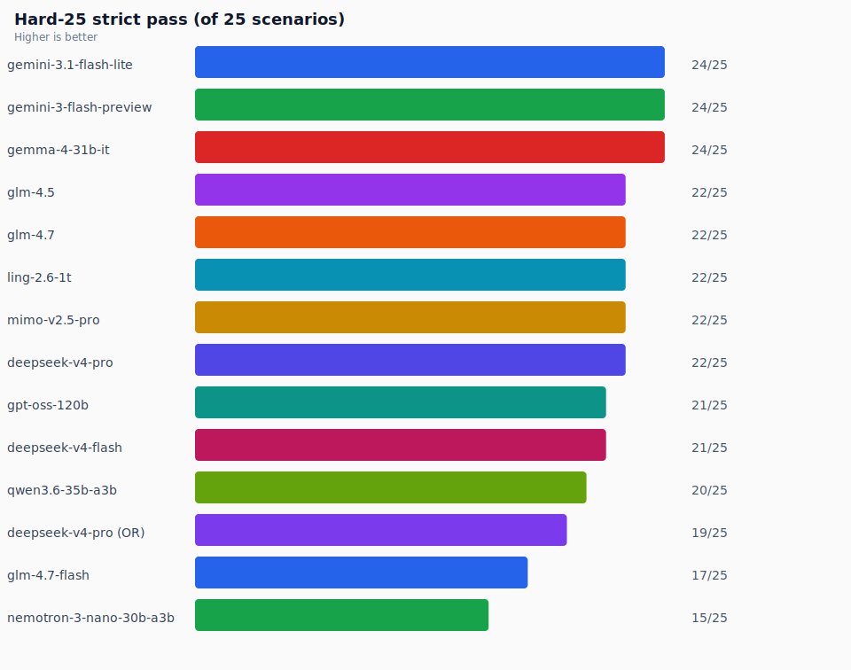
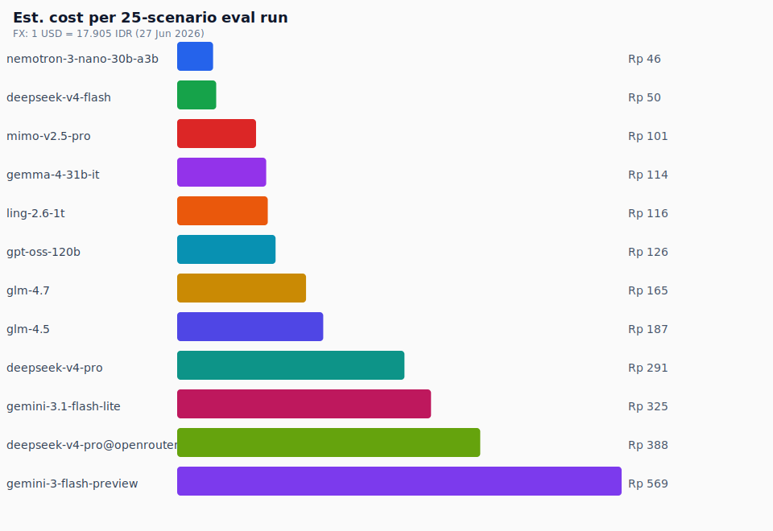
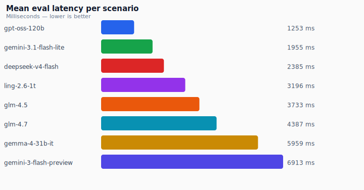
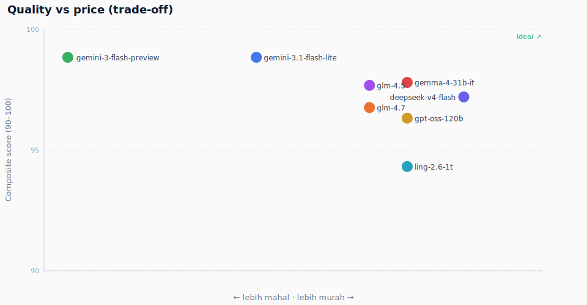
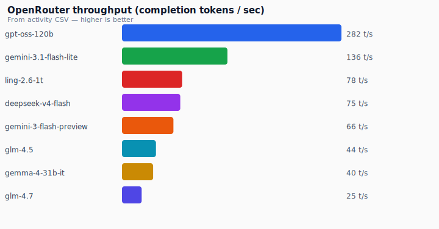

# chat-keuangan-bench

**Open benchmark for parsing Indonesian casual finance chat into structured Rupiah transactions.**

Real users don't type `{"amount": 50000}`. They send WhatsApp-style messages: slang, typos, voice corrections, patungan, `ceban`, `td malem`, `12rb 2 2 nya`. This repo measures how well LLMs extract `pemasukan` / `pengeluaran` entries from that mess — with quality scoring beyond pass/fail.

> **Repo:** [github.com/volfadar/chat-keuangan-bench](https://github.com/volfadar/chat-keuangan-bench)  
> Former name: `rupiah-bench` (renamed for clarity — *chat keuangan* = finance chat).

---

## Executive report (Jun 2026)

Eight models were evaluated on **25 extreme Indonesian finance-parse scenarios** (hard-25), merged with **OpenRouter activity CSV** for real cost and throughput.

**FX rate used:** 1 USD = **17.905 IDR** (27 Jun 2026, ~12:50 WIB)

### Visual scorecard

Eight models · hard-25 eval · charts at full width (not squeezed into one row).

#### Strict pass rate

<p align="center">
  
</p>

#### Cost per 25-scenario eval run (IDR)

<p align="center">
  
</p>

#### Mean latency per scenario

<p align="center">
  
</p>

#### Quality vs price

<p align="center">
  
</p>

#### Throughput (OpenRouter)

<p align="center">
  
</p>

Full tables + notes: **[`docs/REPORT.md`](docs/REPORT.md)**

### Model ranking (hard-25)

| Rank | Model | Strict | Composite | Latency | $/25-run | **IDR/25-run** | Production fit |
|------|-------|--------|-----------|---------|----------|----------------|----------------|
| 🥇 | `google/gemini-3.1-flash-lite` | **24/25** | 99 | ~2.0s | $0.0181 | **Rp 324** | **Recommended** |
| 🥈 | `google/gemini-3-flash-preview` | **24/25** | 99 | ~6.9s | $0.0318 | **Rp 570** | Same quality, slower & pricier |
| 🥉 | `google/gemma-4-31b-it` | **24/25** | 98 | ~6.0s | $0.0064 | **Rp 114** | Strong; weak on qty×unit edge |
| 4 | `z-ai/glm-4.5` | 22/25 | 98 | ~3.7s | $0.0105 | **Rp 187** | Slang + date quirks |
| 5 | `z-ai/glm-4.7` | 22/25 | 97 | ~4.4s | $0.0092 | **Rp 165** | Same failure pattern as 4.5 |
| 6 | `inclusionai/ling-2.6-1t` | 22/25 | 94 | ~3.2s | $0.0065 | **Rp 116** | Lower composite |
| 7 | `openai/gpt-oss-120b` | 21/25 | 96 | **~1.3s** | $0.0070 | **Rp 125** | Fastest; 21/25 strict |
| 8 | `deepseek/deepseek-v4-flash` | 21/25 | 97 | ~2.4s | **$0.0028** | **Rp 50** | Cheapest; 21/25 strict |

### Cost at production scale (IDR)

Per **single parse request** (from OpenRouter CSV averages):

| Model | $/request | **IDR/request** | 1.000 msg/day | 30.000 msg/month |
|-------|-----------|-----------------|---------------|------------------|
| gemini-3.1-flash-lite | $0.00073 | **Rp 13** | Rp 13rb | Rp 391rb |
| gemini-3-flash-preview | $0.00127 | **Rp 23** | Rp 23rb | Rp 690rb |
| deepseek-v4-flash | $0.00011 | **Rp 2** | Rp 2rb | Rp 60rb |
| gpt-oss-120b | $0.00028 | **Rp 5** | Rp 5rb | Rp 151rb |

> **Value index caveat:** `deepseek-v4-flash` wins “value” only because cost is tiny; strict score is 21/25, not 24/25.

### Key findings

1. **Three models tie at 24/25** — `gemini-3.1-flash-lite` wins on **speed + cost** among the top tier.
2. **All 8 models share 4 failure scenarios** — mostly **date-label semantics** (`tadi malam` → `kemarin` vs `hari_ini`) where amounts are already correct.
3. **Don't chase 25/25 via prompt A/B** — a confirm UI in production beats burning API budget on benchmark hacking.
4. **Legitimate wins:** datetime anchor in system prompt (`Sekarang: {date} WIB`), optional slang glossary (`ceban`=10rb), user confirmation for ambiguous dates.

Details: [`docs/FINDINGS.md`](docs/FINDINGS.md) · [`docs/results/hard-25-analysis-8models.md`](docs/results/hard-25-analysis-8models.md)

### SaaS pricing hint

Building AI **pencatatan keuangan**? Plan **~Rp 20/parse** (gemini-3.1 + retry buffer). Keep **core manual** at Rp 49–79rb/mo; sell **AI chat as add-on** Rp 49–99rb/mo with parse caps (e.g. 100/mo), not unlimited in base. Target **AI COGS ≤ 15–20% of ARPU**. Monthly AI at scale: 1k users × 80 parses ≈ **Rp 1,6jt**; 30k parses/day ≈ **Rp 390rb** (see table above).

---

## What it tests

| Suite | Scenarios | Purpose |
|-------|-----------|---------|
| **base** (~28) | Everyday ID chat styles | Regression breadth |
| **stress** (12) | Income direction, bulk lists, corrections | Known failure modes |
| **hard-12** | 12 extreme edge cases | Cross-model torture test |
| **hard-25** | 12 rewrites + 13 new angles | Primary model-selection suite |
| **prompt-tune** | 4 failures × prompt variants | Optional — API-heavy |

Scoring: **quality tiers** (`excellent` → `broken`), composite scores, alt-strict layouts, hallucination / price-copy detection.

---

## Quick start

```bash
git clone https://github.com/volfadar/chat-keuangan-bench.git
cd chat-keuangan-bench
cp .env.example .env   # add OPENROUTER_API_KEY
bun install

# Full base suite (default: gemma-4-31b-it)
bun run eval

# Hard-25 — recommended for model selection
bun run eval:hard-25

# Regenerate scorecard + charts (needs results JSON + CSV)
bun run eval:scorecard
bun run report
```

Requires [Bun](https://bun.sh) and an [OpenRouter](https://openrouter.ai) API key.

---

## Architecture

```
src/core/eval-core.ts          # Schema, prompt, parser, scoring, base+stress scenarios
scripts/eval-hard-*.ts         # Hard suite runners + quality analysis
scripts/build-finance-model-scorecard.ts  # Merge eval JSON + CSV → scorecard
scripts/generate-report-assets.ts         # SVG charts + docs/REPORT.md (IDR)
docs/charts/                   # Generated visualizations
docs/results/                  # Sample scorecard JSON + analysis
```

### Output schema

```json
{
  "entries": [{
    "type": "pengeluaran | pemasukan",
    "tanggal_hint": "hari_ini | kemarin | ...",
    "deskripsi": "string",
    "jumlah": 50000,
    "ambigu": false,
    "catatan_ambigu": null
  }],
  "bukan_transaksi": false,
  "ringkasan": null
}
```

---

## CLI reference

### Main eval (`bun run eval`)

| Flag | Description |
|------|-------------|
| `--model <id>` | Single OpenRouter model |
| `--models a,b` | Compare comma-separated models |
| `--compare` | Default 2-model compare |
| `--suite base\|stress\|all` | Scenario set |
| `--dry-run` | Print scenarios, no API |

### Hard suites

| Flag | Description |
|------|-------------|
| `--model <id>` | Run one model only |
| `--models a,b` | Comma-separated roster |
| `--merge-from <json>` | Merge prior partial run |
| `--dry-run` | List scenarios |

### Report generation

```bash
bun run report   # SVG charts + docs/REPORT.md from docs/results/scorecard.json
```

---

## Contributing

PRs welcome: new scenarios (realistic Indonesian chat only), scoring improvements, additional models. Please **don't** add scenarios that mirror few-shot examples in the system prompt.

## License

MIT — see [LICENSE](LICENSE).

## Attribution

Originally developed while building finance chat parsing for an Indonesian pesantren/e-commerce platform. Extracted as a standalone open benchmark so others can reproduce and extend without coupling to any private app.
