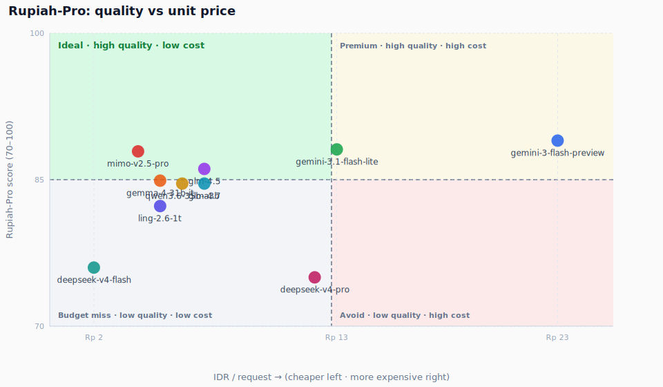

# chat-keuangan-bench

Open benchmarks for **Indonesian casual finance chat** — WhatsApp-style slang, corrections, receipts, mutasi, and multi-org ledgers.

> **Repo:** [github.com/volfadar/chat-keuangan-bench](https://github.com/volfadar/chat-keuangan-bench)  
> Two suites live here: **Parse-25** (single-turn extraction) and **Rupiah-Pro** (multi-turn agent).

---

## Two benches

| | **Parse-25** | **Rupiah-Pro** |
|--|--------------|----------------|
| **What** | One-shot parse of a chat message → structured `pemasukan` / `pengeluaran` JSON | Multi-turn agent with tools: ledger, OCR, CSV/PDF, org switch, auditor packs |
| **Size** | 25 hard scenarios (+ base/stress for regression) | 28 run scenarios; **public score uses 14 discriminative** |
| **Public score** | Strict pass + composite quality tiers | `100 × (det/40)² × (ifBench/100)` — **v1.0** |
| **Typical range** | Top models ~21–24/25 | Leaderboard ~**75–89** (not 89–98 mush) |
| **Run** | `bun run eval:hard-25` | `bun run eval:agentic` then `bun run score:rupiah-pro` |
| **Deep dive** | [`docs/REPORT.md`](docs/REPORT.md) · [`docs/FINDINGS.md`](docs/FINDINGS.md) | [`docs/AGENTIC.md`](docs/AGENTIC.md) · [leaderboard](docs/results/agentic/rupiah-pro-leaderboard-latest.md) |

**Parse-25** answers: *Can the model read the message?*  
**Rupiah-Pro** answers: *Can it bookkeep across turns with tools without corrupting the ledger?*

---

## Rupiah-Pro (agentic) — public v1

Multi-turn **pencatatan keuangan**: personal + yayasan/sekolah, slang corrections, patungan, OCR notas, bank mutasi, contaminated history, auditor export.

### Leaderboard (v1.0)

| Rank | Model | Score | min | <60 | <80 |
|-----:|-------|------:|----:|----:|----:|
| 1 | `google/gemini-3-flash-preview` | **89.0** | 26 | 2 | 3 |
| 2 | `google/gemini-3.1-flash-lite` | **88.1** | 36 | 2 | 3 |
| 3 | `xiaomi/mimo-v2.5-pro` | **87.9** | 36 | 1 | 4 |
| 4 | `z-ai/glm-4.5` | **86.1** | 9 | 2 | 3 |
| 5 | `google/gemma-4-31b-it` | **84.9** | 27 | 2 | 5 |
| 6 | `z-ai/glm-4.7` | **84.6** | 36 | 3 | 4 |
| 7 | `qwen/qwen3.6-35b-a3b` | **84.6** | 0 | 2 | 3 |
| 8 | `inclusionai/ling-2.6-1t` | **82.3** | 9 | 3 | 3 |
| 9 | `deepseek/deepseek-v4-flash` | **76.0** | 11 | 4 | 6 |
| 10 | `deepseek/deepseek-v4-pro` | **75.0** | 16 | 4 | 6 |

**Spread:** 14.0 points · **n = 14** discriminative scenarios · full table: [`rupiah-pro-leaderboard-latest.md`](docs/results/agentic/rupiah-pro-leaderboard-latest.md)

<p align="center">
  
</p>

Ideal quadrant: **top-left** (high score, cheaper left). Cost = measured OpenRouter **IDR/request** (same Parse-25 scorecard prices — not parallel suite wall-share). Charts: [`docs/charts/rupiah-pro/`](docs/charts/rupiah-pro/)

### Scoring (public v1)

```text
score = 100 × (det/40)² × (ifBench/100)
```

| Piece | Role |
|-------|------|
| **det** | Deterministic ledger/org/file/tool asserts (0–40) |
| **ifBench** | Instruction-following rules R1–R14 (0–100), used as multiplier |
| **Not in public avg** | Rubric + step (still logged in raw run JSON for audit) |

Easy forever-100 scenarios are **culled from the headline board** so averages stay discriminative. Raw traces still cover all 28.

### What a scenario looks like

```
User: bro td malem berantakan: pulsa 25rb, cilok 4 tusuk 5rb 4 4 nya…
Agent: (tools) sqlite_exec / list_inbox / receipt_ocr / csv_read …
→ ledger rows must match asserts; wrong qty bleed / premature post fails det
```

Tools include SQLite ledger, inbox + OCR, CSV/PDF readers, export. Web search is for info only — it **refuses** “cari nota/struk”.

### Run Rupiah-Pro

```bash
bun run eval:agentic -- --suite all --model google/gemma-4-31b-it --concurrency 3
bun run score:rupiah-pro          # leaderboard + charts from saved traces
bun run report:rupiah-pro         # charts only
bun run studio                    # Mastra traces → http://localhost:4111
```

Judge for new runs: `deepseek/deepseek-v4-pro` @ DeepSeek, combined mode, high reasoning. Details: [`docs/AGENTIC.md`](docs/AGENTIC.md).

---

## Parse-25 (single-turn) — hard-25

Extract structured Rupiah transactions from one messy chat line. Primary model-selection suite for **parse-only** products.

### Snapshot (Jun 2026)

| Rank | Model | Strict | Composite | IDR/25-run |
|-----:|-------|-------:|----------:|-----------:|
| 1 | `google/gemini-3.1-flash-lite` | **24/25** | 99 | Rp 325 |
| 2 | `google/gemini-3-flash-preview` | **24/25** | 99 | Rp 570 |
| 3 | `google/gemma-4-31b-it` | **24/25** | 98 | **Rp 114** |
| 4–7 | glm-4.5 / mimo / deepseek-v4-pro / glm-4.7 | 22/25 | 97–98 | Rp 101–291 |
| … | See full table | | | |

**Recommended value pick:** `gemma-4-31b-it` (same 24/25 tier, ~2.6× cheaper than gemini-3.1).

Charts + cost tables: [`docs/REPORT.md`](docs/REPORT.md) · findings: [`docs/FINDINGS.md`](docs/FINDINGS.md)

<p align="center">
  
</p>

Ideal quadrant: **top-left** (high composite, cheaper left). Also: [`strict-pass.svg`](docs/charts/strict-pass.svg) · full charts in [`docs/REPORT.md`](docs/REPORT.md)

### Sample inputs

```
td sore beli pulsa 25rb sama jajan cilok 4 tusuk 5rb 4 4 nya
tadi jajan es teh ceban sama gorengan goceng
gojek ke masjid 15rb... eh maksudnya 50rb
```

Non-transaction (must set `bukan_transaksi: true`):

```
gw lagi males banget hari ini pengen tidur aja
```

### Run Parse-25

```bash
bun run eval:hard-25
bun run eval:single -- --model google/gemma-4-31b-it
bun run bench:refresh    # scorecard + charts + analysis
```

---

## Quick start

```bash
git clone https://github.com/volfadar/chat-keuangan-bench.git
cd chat-keuangan-bench
cp .env.example .env   # OPENROUTER_API_KEY (+ DEEPSEEK_API_KEY optional)
bun install

# Parse-25
bun run eval:hard-25

# Rupiah-Pro
bun run eval:agentic -- --suite all --model google/gemma-4-31b-it
bun run score:rupiah-pro
```

Requires [Bun](https://bun.sh) and an [OpenRouter](https://openrouter.ai) key. Agentic OCR/web fixtures may use `FIRECRAWL_API_KEY`.

---

## Repo map

```
src/core/          Parse-25 harness (schema, prompt, hard-25)
src/agentic/       Rupiah-Pro harness (scenarios, tools, judge, runner)
src/mastra/        Studio + observability
scripts/           Eval runners + score:rupiah-pro
fixtures/          Notas, mutasi CSV, rekening PDF
docs/
  AGENTIC.md       Rupiah-Pro deep dive
  REPORT.md        Parse-25 full report + charts
  FINDINGS.md      Parse-25 research notes
  results/agentic/ Raw runs + rupiah-pro-leaderboard-latest.*
```

---

## Progressive disclosure

| Want… | Go to |
|-------|--------|
| Rupiah-Pro scoring, tools, fixtures, IF rules | [`docs/AGENTIC.md`](docs/AGENTIC.md) |
| Rupiah-Pro full per-scenario table | [`docs/results/agentic/rupiah-pro-leaderboard-latest.md`](docs/results/agentic/rupiah-pro-leaderboard-latest.md) |
| Parse-25 charts, IDR cost, latency | [`docs/REPORT.md`](docs/REPORT.md) |
| Parse-25 failure modes / model notes | [`docs/FINDINGS.md`](docs/FINDINGS.md) · [`docs/results/hard-25-analysis.md`](docs/results/hard-25-analysis.md) |
| Design history (agentic suite) | [`docs/plans/2026-07-09-agentic-hard-20-design.md`](docs/plans/2026-07-09-agentic-hard-20-design.md) |
| Publish checklist | [`PUBLISH.md`](PUBLISH.md) |

---

## Contributing

PRs welcome: realistic Indonesian chat scenarios, harder discriminative cases for Rupiah-Pro, scoring fixes. Please **don’t** add scenarios that mirror few-shot examples in the system prompt.

## License

MIT — see [LICENSE](LICENSE).

## Attribution

Built while shipping finance chat for an Indonesian pesantren / e-commerce stack. Extracted as an open benchmark so others can reproduce without private app coupling.
