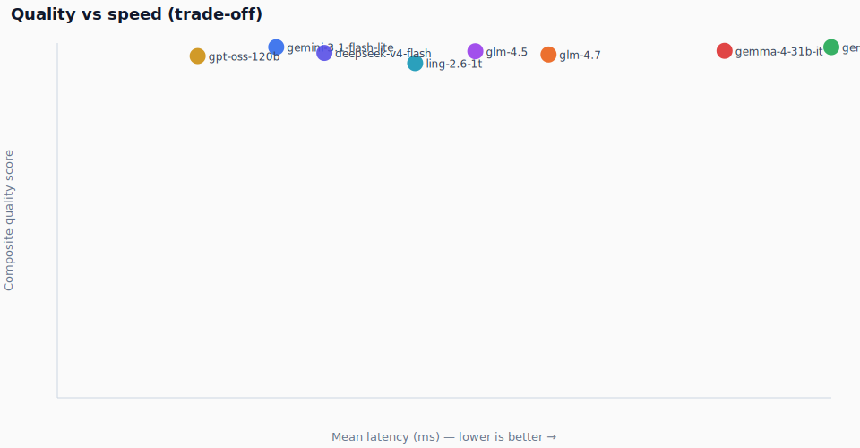

# Model comparison report

Generated from hard-25 eval + OpenRouter activity CSV.
**FX:** 1 USD = **17.905 IDR** (27 Jun 2026, ~12:50 WIB)

## Visual summary

### Strict pass rate

### Cost per full eval (25 scenarios)

### Latency

### Quality vs speed

### Throughput

## Master table (USD + IDR)

| Model | Strict | Composite | Latency | $/25-run | IDR/25-run | $/request | IDR/request |
|-------|--------|-----------|---------|----------|------------|-----------|-------------|
| gemini-3.1-flash-lite | 24/25 | 99 | 1955ms | $0.0181 | Rp 325 | $0.00073 | Rp 13 |
| gemini-3-flash-preview | 24/25 | 99 | 6913ms | $0.0318 | Rp 569 | $0.00127 | Rp 23 |
| gemma-4-31b-it | 24/25 | 98 | 5959ms | $0.0064 | Rp 114 | $0.00025 | Rp 5 |
| glm-4.5 | 22/25 | 98 | 3733ms | $0.0105 | Rp 187 | $0.00042 | Rp 7 |
| glm-4.7 | 22/25 | 97 | 4387ms | $0.0092 | Rp 165 | $0.00037 | Rp 7 |
| ling-2.6-1t | 22/25 | 94 | 3196ms | $0.0065 | Rp 116 | $0.00026 | Rp 5 |
| gpt-oss-120b | 21/25 | 96 | 1253ms | $0.0070 | Rp 126 | $0.00028 | Rp 5 |
| deepseek-v4-flash | 21/25 | 97 | 2385ms | $0.0028 | Rp 50 | $0.00011 | Rp 2 |

## Recommendations

| Use case | Model | Why |
|----------|-------|-----|
| **Production (best overall)** | `gemini-3.1-flash-lite` | 24/25 strict, ~2s, acceptable cost (~Rp 324/25-run) |
| **Quality tie, slower** | `gemini-3-flash-preview` | Same 24/25, higher cost (~Rp 569/25-run) |
| **Fastest** | `gpt-oss-120b` | ~1.3s/scenario, 282 t/s — 21/25 strict |
| **Cheapest** | `deepseek-v4-flash` | ~Rp 50/25-run — 21/25 strict |

> Per-message inference at scale: multiply **IDR/request** by your daily message volume.