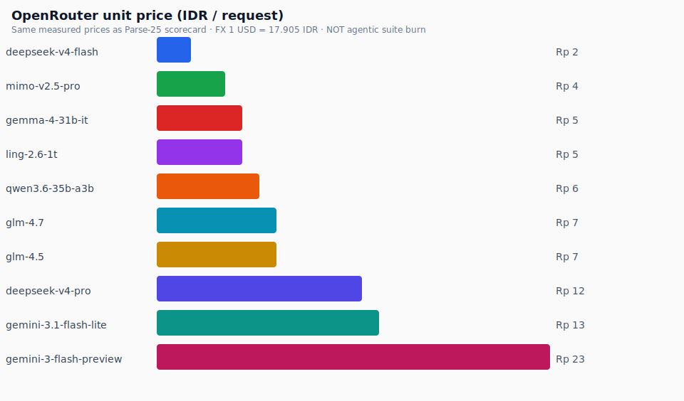

# Rupiah-Pro charts

Generated: 2026-07-09T23:33:25.659Z

Same visual language as Parse-25. Cost X-axis: **cheaper left → expensive right**; ideal quadrant **top-left**.

**Cost method:** overall.spentUsd from budget-track batches, attributed by wallMs share among successful models in that batch. Models without a budget track (gemma-4-31b-it, deepseek-v4-flash) use median attributed-USD/total-scenario-ms × their totalMs.

> Parallel runs share one OpenRouter key; wall-share is the best offline attribution until serial re-runs with per-model key snapshots.

#### Public score
Rupiah-Pro v1 · 14 discriminative scenarios.

  

#### Suite cost (IDR)
FX: 1 USD = 17.905 IDR. * = estimated (no budget track).

  

#### Mean scenario latency

  

#### Quality vs suite cost
Ideal quadrant: **top-left** (high score, cheaper → left).

  

## Cost table

| Model | Score | Mean latency | Suite $ | Suite IDR | Method |
|-------|------:|-------------:|--------:|----------:|--------|
| `gemini-3-flash-preview` | 89 | 57s | $0.200 | Rp 3.575 | measured† |
| `gemini-3.1-flash-lite` | 88.1 | 43s | $0.161 | Rp 2.886 | measured† |
| `mimo-v2.5-pro` | 87.9 | 96s | $0.328 | Rp 5.879 | measured† |
| `glm-4.5` | 86.1 | 54s | $0.202 | Rp 3.625 | measured† |
| `gemma-4-31b-it` | 84.9 | 79s | $0.284 | Rp 5.091 | estimated* |
| `glm-4.7` | 84.6 | 66s | $0.237 | Rp 4.246 | measured† |
| `ling-2.6-1t` | 82.3 | 51s | $0.197 | Rp 3.526 | measured† |
| `deepseek-v4-flash` | 76 | 58s | $0.207 | Rp 3.713 | estimated* |
| `deepseek-v4-pro` | 75 | 62s | $0.216 | Rp 3.876 | measured† |
| `qwen3.6-35b-a3b` | 62.2 | 60s | $0.210 | Rp 3.766 | measured† |

† Wall-share of measured batch `overall.spentUsd`. * Median USD/ms × scenario totalMs.
