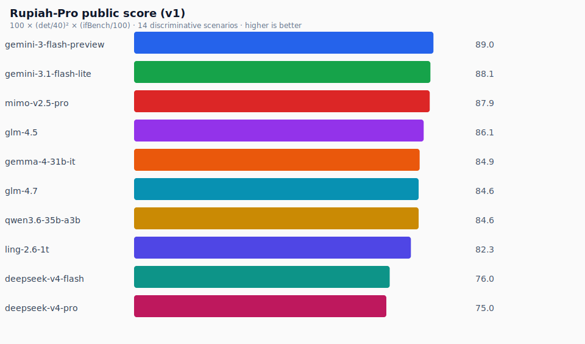
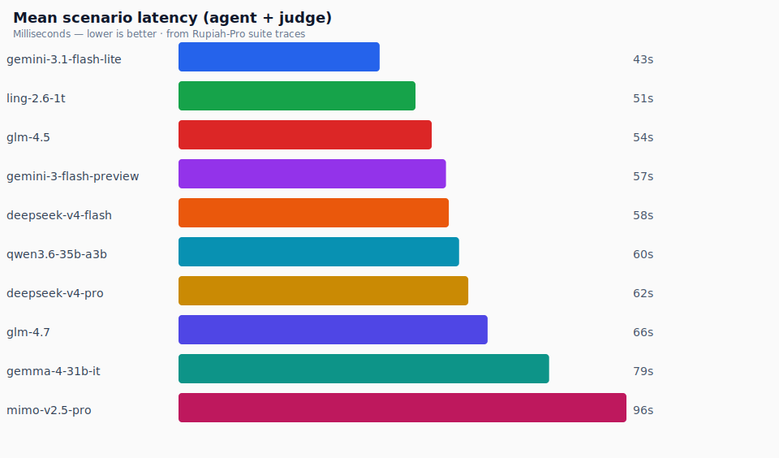

# Rupiah-Pro charts

Generated: 2026-07-12T09:23:29.873Z

Same visual language as Parse-25. Cost X-axis: **cheaper left → expensive right**; ideal quadrant **top-left**.

**Public cost metric:** measured OpenRouter **IDR/request** from the Parse-25 scorecard (same source as Parse-25 quality-vs-price).

> Agentic suite $ burn from parallel batches is **not** used on the public chart — wall-share wrongly ranked slow/cheap models (e.g. Gemma) above Gemini.

#### Public score
Rupiah-Pro v1 · 14 discriminative scenarios.

  

#### Unit price (IDR / request)
FX: 1 USD = 17.905 IDR · Parse-25 scorecard.

  

#### Mean scenario latency

  

#### Quality vs unit price
Ideal quadrant: **top-left** (high score, cheaper → left).

  

## Cost table

| Model | Score | Mean latency | IDR/req | $/25-parse |
|-------|------:|-------------:|--------:|-----------:|
| `gemini-3.1-flash-lite` | 88.1 | 43s | Rp 13 | $0.0181 |
| `mimo-v2.5-pro` | 87.9 | 96s | Rp 4 | $0.0057 |
| `glm-4.5` | 86.1 | 54s | Rp 7 | $0.0105 |
| `gemma-4-31b-it` | 84.9 | 79s | Rp 5 | $0.0064 |
| `glm-4.7` | 84.6 | 66s | Rp 7 | $0.0092 |
| `qwen3.6-35b-a3b` | 84.6 | 52s | Rp 6 | $0.0086 |
| `ling-2.6-1t` | 82.3 | 51s | Rp 5 | $0.0065 |
| `deepseek-v4-flash` | 76 | 58s | Rp 2 | $0.0028 |
| `deepseek-v4-pro` | 75 | 62s | Rp 12 | $0.0162 |
